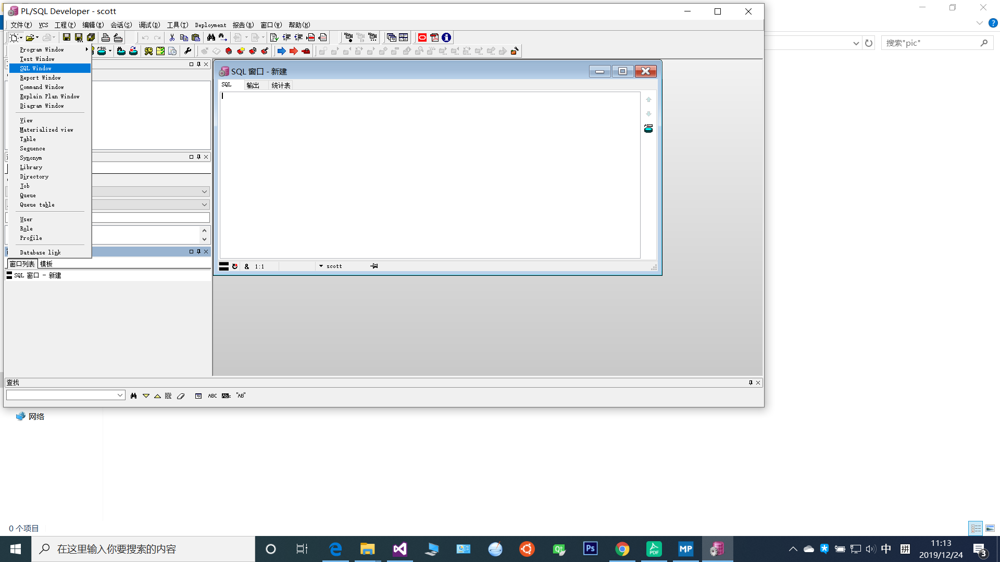
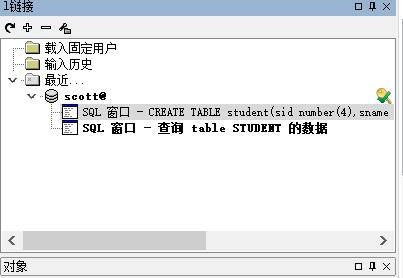
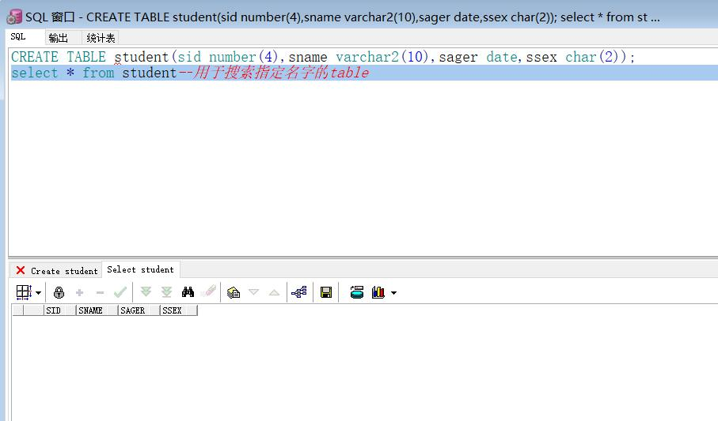

oracle的三种用户

sys用户（超级管理员，可以创建数据库）：数据库中所有的数据字典表和视图都储存在sys模式中。sys用户主要用来维护信息系统和管理实例。
system用户（管理员，不能创建数据库）：system用户是默认的系统管理员、该用户拥有Cracle管理工具使用的内部表和视图。通常通过system用户管理数据库用户、权限和储存等

scott用户：scott用户是Oracle数据库的一个示范账户，在数据安装时创建。

登陆命令： sqlplus 用户名/密码 conn 用户名/密码
解锁用户(不行加;)：alter user 用户名 account unlock
锁定用户：alter user 用户名 account lock

修改用户密码：

a：conn / as sysdba
b:alter user 用户名 identified by 密码

显示当前登陆账户： show user;
退出命令：exit

sql（structed query language）
其中sql又细化为以下语言
1.ddl(data definition language) 数据定义语言 create table, update table,drop table
2.dml(data manipulation language)数据操作语言
3.tcl（transacation control language）事物控制语言
4.dcl（data control language）数据控制语言
5.dql（data query language）数据查询语言

创建一个sql窗口

命令方式创建表：
CREATE TABLE 表名(字段1 类型(大小)，字段2类型(大小)); 
例如：
CREATE TABLE student(sid number(4),sname varchar2(10),sager date,ssex char(2)); 
select * from student--用于搜索指定名字的table

调整窗口

效果

字段类型
CHAR(n) n=1 to 2000 字节 ，定长字符串，如果不指定长度，缺省为一个字节长（GBK一个汉字为2字节，UTF-8一个汉字为3个字节）
VARCHAR2(n) n=1 to 4000 字节 可变长的字符串，具体定义时指明最大长度n，varchar可以放数字、字母以及ASCII码字符集（或EBCDIC等数据库接受的字符集标准）中的所有符号。